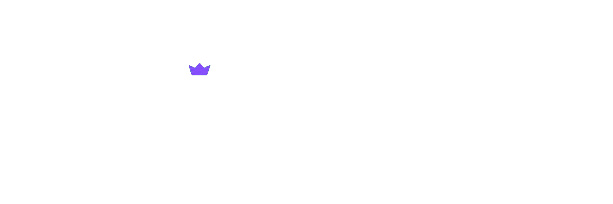

<p align="center">
  
</p>

<p align="center">
A spatial workspace for coordinating coding agents through Claude Code,
OpenAI Codex, OpenCode, and Pi harnesses. Give a Leader a complex task, and it
spawns parallel Minion agents that collaborate in real time.
</p>

> **Status:** Early-stage open-source software. Interfaces and data formats may
> change, and rough edges should be expected.

---

## What This Is

Minions gives you a spatial interface for orchestrating coding agents:

- **Infinite canvas** — drag, zoom, arrange nodes visually
- **Leader/Minion orchestration** — give a Leader a complex task, and it spawns Minion agents, wires them up, and tracks progress through a live task board
- **Git worktree isolation** — each Minion works in its own worktree so parallel agents don't conflict, and changes route through an explicit approval flow before merging
- **Skills browser** — browse, create, and launch pre-configured skill templates
- **Project management** — persistent projects with SQLite storage, session history, cost tracking
- **Multiple agent harnesses** — use Claude Code, OpenAI Codex, OpenCode, or Pi, with each installed harness exposing its own configured model catalog

## Prerequisites

You need all of the following installed before starting:

| Requirement | Why |
|---|---|
| **At least one agent harness** | Claude Code and Codex can use their bundled SDK runtimes. OpenCode and Pi are discovered on `PATH` (or via `OPENCODE_PATH` / `PI_PATH`). Authenticate with the harness itself; Minions derives model choices from each ready harness. |
| **Node.js ≥ 22** | Required by the agent SDKs and modern runtime features |
| **pnpm** | Package manager (`npm install -g pnpm` if you don't have it) |
| **git** | Used for repository access and optional worktree isolation |
| **[Tailscale](https://tailscale.com/download)** | Optional, for tailnet HTTPS and the mobile companion |

### Verify your setup

```bash
pnpm preflight
```

This checks the host, loopback ports, native dependencies, and every registered
harness runtime. It succeeds when at least one harness is authenticated and
prints controlled remediation for the others.

## Quick Start

```bash
git clone https://github.com/hipsterusername/minions.git
cd minions
pnpm install
pnpm preflight
pnpm start
```

`pnpm start` launches the backend and Vite together as a background service and
returns the terminal to you immediately. It opens the browser, writes logs to
`.run/minions.log`, and keeps running until you `pnpm stop`. Use `pnpm status`
to check on it. It never configures Tailscale unless you pass `-- --tailscale`.

If you'd rather run in the foreground and stream logs (stopping both on
`Ctrl-C`), use `pnpm dev` instead.

- Local URL: **http://localhost:6173**

That's it. No environment variables, no database setup, no Docker — SQLite handles storage automatically.

## Usage

### Leader/Minion Orchestration

1. Click the **+** button on the canvas toolbar and add a **Leader** node
2. Give the Leader a complex task — it plans the work and spawns **Minion** agents
3. Minion nodes appear on the canvas, automatically wired to the Leader
4. Minions run inside the Leader's isolated worktree, so parallel tasks should own disjoint files
5. The Leader tracks progress, integrates results, and routes the shared worktree through approval

> Minion nodes are created and wired automatically — you never need to add or connect them manually.

### Other Node Types

Click **+** on the canvas toolbar to add:

- **Leader** — orchestrator agent that decomposes work and delegates to Minions
- **Markdown** — rich documentation and notes
- **Image** — drop in screenshots or diagrams as canvas context
- **Dashboard** — render DSL component view (also driven by Leader render tools)
- **Context Group** — group nodes together to feed as context into Leader sessions

Folder and File Viewer nodes are created automatically when you drag in directories or files.

## Configuration

All optional — sane defaults are provided:

| Variable | Default | Description |
|---|---|---|
| `PORT` | `3141` | Backend server port |
| `HOST` | `127.0.0.1` | Server bind address; set explicitly for remote binding |
| `VITE_PORT` | `6173` | Vite and Tailscale-facing application port |
| `CLAUDE_CODE_PATH` | SDK discovery | Optional Claude executable override |
| `CODEX_PATH` | SDK discovery | Optional Codex executable override |
| `CODEX_API_KEY` / `OPENAI_API_KEY` | Codex CLI login | Optional Codex API credentials |

Set them as environment variables:

```bash
PORT=8080 pnpm start
```

Remote browser access is limited to loopback and Tailscale-style hosts
(`100.64.0.0/10`, Tailscale IPv6, and MagicDNS `*.ts.net`). The browser talks to
the backend same-origin — Vite proxies both `/api` and the `/ws` WebSocket to the
server — so changing `PORT` alone is enough; the front end follows automatically:

```bash
PORT=8080 pnpm start
```

### Mobile access over HTTPS (Tailscale)

The mobile companion at `/m` uses **Web Push** for notifications, and browsers
only expose the Service Worker / Push APIs in a **secure context** (HTTPS, or
`localhost`). Opening the app from a phone over `http://<host>:6173` is *not* a
secure context, so the notifications button shows **"Notifications Unsupported"**.

Start the optional background service with tailnet HTTPS:

```bash
pnpm start -- --tailscale
```

Then open `https://<machine>.<tailnet>.ts.net:6173/m` on your phone (small screens
auto-redirect to `/m`). Notifications now work: tap **Enable notifications**.

- Stop the background app: `pnpm stop`.
- A local built preview is `pnpm build && pnpm preview` and includes the backend.
- On **iOS**, Web Push additionally requires iOS 16.4+ and adding the app to the
  Home Screen (Share → *Add to Home Screen*), then launching it from that icon.

This stays tailnet-only; it does not enable `tailscale funnel` (public internet)
or claim the bare `https://<machine>.<tailnet>.ts.net/` origin.

## Scripts

| Command | What it does |
|---|---|
| `pnpm start` | Start the full stack as a background service on loopback (non-blocking) |
| `pnpm start -- --tailscale` | Start the background service and opt into tailnet HTTPS |
| `pnpm dev` | Foreground backend + frontend development server on loopback (streams logs, `Ctrl-C` to stop) |
| `pnpm preview` | Foreground backend + built frontend preview on loopback |
| `pnpm stop` | Stop the background service |
| `pnpm restart` | Restart the background service |
| `pnpm status` | Report whether the background app is running |
| `pnpm server` | Backend server only |
| `pnpm build` | Production build |
| `pnpm typecheck` | TypeScript type checking |
| `pnpm test` | Run vitest in watch mode |
| `pnpm test:run` | Run all tests once (used by CI) |
| `pnpm test:coverage` | Run all tests once and produce a coverage report |
| `pnpm verify` | Run the full CI gate locally (typechecks, tests, licenses, system model, build) |
| `pnpm preflight` | Validate prerequisites |

## Testing & development workflow

Tests are required for all behavioural changes:

1. **Before pushing**, run `pnpm verify` (typechecks, tests, license and system-model checks, build).
   CI runs the same gate and will fail the PR otherwise.
   For an even tighter local loop, install `prek` once
   (`prek install`) — the hook config in `.pre-commit-config.yaml`
   will run typecheck + tests on every commit.
2. **When refactoring**, write a test that captures the current behaviour
   *before* you change the code. The test should pass on `main`, then
   pass unchanged on your branch. If it had to change, you changed
   behaviour — call that out in the PR.
3. **When fixing a bug**, write a failing test first, then make it pass.
   The test stays in the suite.
4. **Test files live next to the code they test** (`src/foo.ts` →
   `src/foo.test.ts`). Cross-tree contract tests live under
   `tests/contracts/`; architecture-fitness tests under
   `tests/architecture/`.

The architecture-fitness suite encodes invariants enforced in CI:
server file size ceilings (≤ 400 lines), no cross-tree imports between
`src/` and `server/`, broadcasts only through `server/bus.ts`, and a
handler registered for every WebSocket command.

## Contributing and security

See [CONTRIBUTING.md](./CONTRIBUTING.md) for the development workflow and
pull-request expectations. Report suspected vulnerabilities privately as
described in [SECURITY.md](./SECURITY.md); do not include credentials, private
repository content, or local transcripts in public issues.

### Harness terms and assumption of risk

Minions is an independent orchestration layer. It operates through locally
installed and authenticated agent harnesses; it does not provide, resell, or
grant access to their underlying model services. You are responsible for
ensuring that how you install, authenticate, configure, and use each harness
complies with the provider's then-current terms, policies, plan or billing
conditions, and any rules imposed by your organization. Review the
[Anthropic legal terms](https://www.anthropic.com/legal) and
[OpenAI policies](https://openai.com/policies/) that apply to your account and
use case. Minions does not alter or supersede those terms, and references to
provider products do not imply provider endorsement.

Minions is provided on an "AS IS" basis, without warranties or conditions of
any kind, as set out in the [Apache License 2.0](./LICENSE). You use Minions at
your own risk. Coding agents can read and modify files, run commands, create
worktrees, contact configured services, and consume paid provider capacity with
the permissions and credentials you give them. Review permission settings,
protect credentials, keep recoverable backups, and supervise consequential
actions.

Run Minions only on a trusted local machine or private tailnet. Worktrees are
coordination boundaries, not sandboxes: agents, local MCP commands, and enabled
tools run with the permissions of the account that started Minions. Review
provider permissions and project-owned `.minions/mcp-servers.json` entries
before launching unattended sessions.

## Architecture

```
Browser (localhost:6173 or Tailscale HTTPS host:6173)
  │
  ├── React 19 + Vite 8 (infinite canvas UI)
  │
  └── WebSocket ──► Express session host (same host:3141)
                      │
                      ├── AgentHarness
                      │   ├── Claude Agent SDK / Claude Code
                      │   ├── OpenAI Codex SDK / Codex CLI
                      │   ├── OpenCode CLI
                      │   └── Pi CLI
                      ├── SQLite (per-project state)
                      ├── MCP tools (task management, render dashboard)
                      └── Git worktree manager (agent isolation)
```

### Key directories

```
src/                  Frontend React application
  nodes/              Node type components (Leader, Minion, ClaudeSession, …)
  prompts/            System prompts shared with the frontend
  components/         Shared UI components
server/               Backend Express + WebSocket server
  agents/             Per-agent (leader, minion, default) wiring
  harness/            Claude, Codex, OpenCode, Pi, and test adapters
  mcp-bridge/         Loopback bridge for harness MCP tool access
  commands/           Per-command WebSocket handlers
  routes/             REST API route handlers
  task-tools/         MCP tools for Leader task management
  minion-tools.ts     MCP tools for Minion reporting
  render-tools.ts     MCP tools for Dashboard render DSL
  bus.ts              Typed event bus — all broadcasts go through here
  worktree*.ts        Git worktree lifecycle and approval flow
scripts/              Utility scripts (preflight, permission setup)
```

## Troubleshooting

**"claude: command not found"**
Install Claude Code and sign in: https://docs.anthropic.com/en/docs/claude-code

**Sessions fail to start**
Make sure `claude` works on its own first — run `claude` in your terminal to verify authentication.

**Codex sessions report missing credentials**
Run `codex login`, or start Minions with `CODEX_API_KEY` or `OPENAI_API_KEY`
available in the server environment.

**OpenCode or Pi does not appear with models**
Run `opencode models` or `pi --list-models` in the project directory. Minions
shows the effective catalog returned by that command. Set `OPENCODE_PATH` or
`PI_PATH` when the executable is not on the server's `PATH`.

**Port already in use**
Another instance may be running. Kill it or use a different port: `PORT=3142 pnpm start`

**Native module build errors during `pnpm install`**
`better-sqlite3` requires a C++ compiler. On macOS run `xcode-select --install`. On Ubuntu/Debian: `sudo apt install build-essential`.

## License

Minions is licensed under the [Apache License 2.0](./LICENSE).

---

Built with the
[Claude Agent SDK](https://www.npmjs.com/package/@anthropic-ai/claude-agent-sdk)
and [OpenAI Codex SDK](https://www.npmjs.com/package/@openai/codex-sdk), with
CLI adapters for [OpenCode](https://opencode.ai/docs/) and
[Pi](https://github.com/earendil-works/pi).
